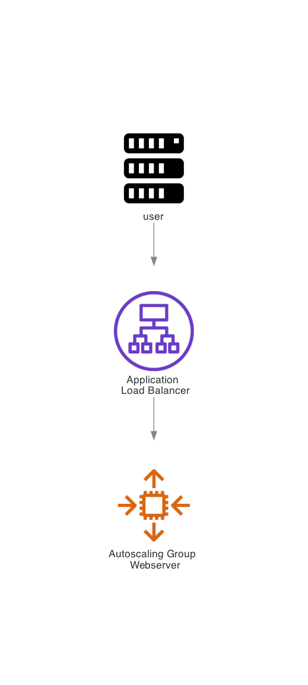
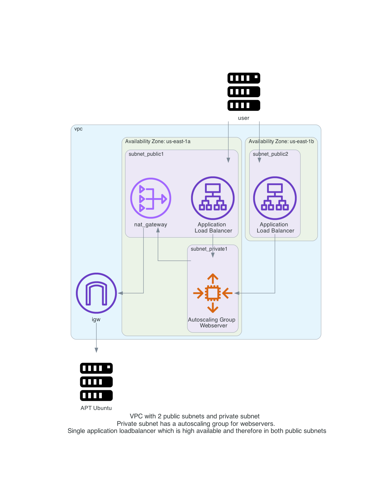
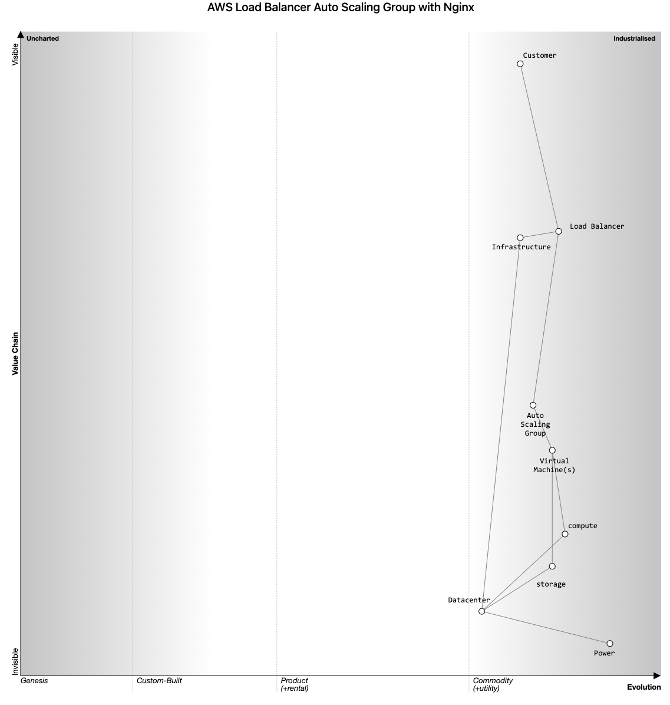
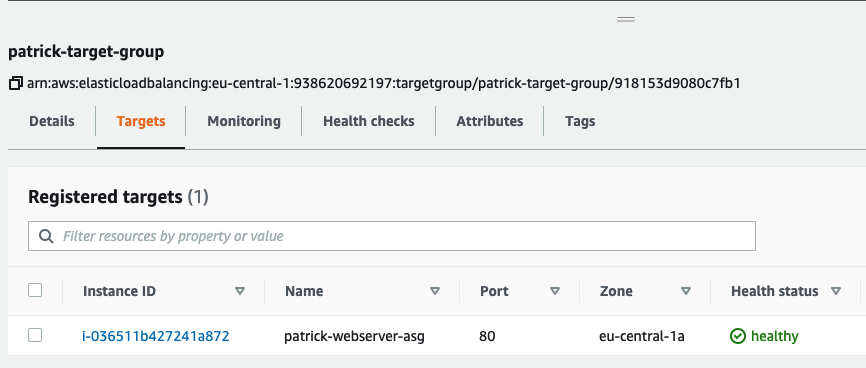
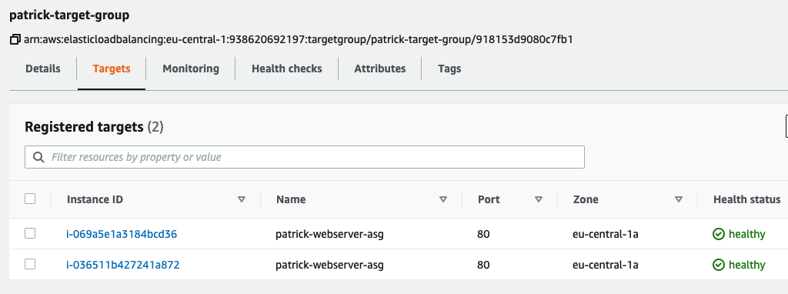

# AWS Loadbalancer with an auto scaling group for nginx webservers

In this repository you will deploy an auto scaling group with a webserver EC2 behind an application load balancer with Terraform on AWS. 

Steps involved are: 
- Create a VPC with subnets, routing tables, internet gateway and nat gateway
- Creating an auto scaling launch configuration with Ubuntu and Nginx installation script
- Creating an auto scaling group for EC2 instances using a launch configuration
- Creating a Security group that allows traffic over port 80 to the load balancer and auto scaling group instances
- Create an application load balancer to forward http traffic to the auto scaling group instances in the private subnet

Diagram of the environment:    
Simple:  
    

Detailed:  
    

Wardley Map:
    

There is a short [README.md](manual_steps/README.md) on how to do all this manually without Terraform. This is just to give you a better idea on the steps involved. Please use this only if you do not want to use Terraform. 

# Prerequisites

## AWS
We will be using AWS. Make sure you have the following
- AWS account  
- Install AWS cli [See documentation](https://docs.aws.amazon.com/cli/latest/userguide/install-cliv2.html)

## Install terraform  
See the following documentation [How to install Terraform](https://learn.hashicorp.com/tutorials/terraform/install-cli)

# How to

- Clone the repository to your local machine
```
git clone https://github.com/munnep/aws_asg_nginx.git
```
- Go to the directory
```
cd aws_asg_nginx
```
- Set your AWS credentials
```
export AWS_ACCESS_KEY_ID=
export AWS_SECRET_ACCESS_KEY=
export AWS_SESSION_TOKEN=
```
- Terraform initialize
```
terraform init
```
- Terraform plan
```
terraform plan
```
- Terraform apply
```
terraform apply
```
- Terraform output should create 18 resources and show you the public dns string you can use to connect to the webserver
```
Apply complete! Resources: 18 added, 0 changed, 0 destroyed.

Outputs:

http_link = "http://patrick-lb-1524684924.eu-central-1.elb.amazonaws.com"
```
- You should be able to connect to the http_link with your web browser and see the nginx default webpage

## Test the auto scaling group 
- currently you should see 1 instance under the Load Balancer Target group  
  
- create a file called ```variables.auto.tfvars``` with the following content
```
asg_desired_capacity = 2
```
- Terraform plan
```
terraform plan
```
- Terraform apply
```
terraform apply
```
- This should make 1 change
```
 # aws_autoscaling_group.as_group will be updated in-place
  ~ resource "aws_autoscaling_group" "as_group" {
      ~ desired_capacity          = 1 -> 2
        id                        = "patrick-asg"
        name                      = "patrick-asg"
        # (22 unchanged attributes hidden)


        # (2 unchanged blocks hidden)
    }

Plan: 0 to add, 1 to change, 0 to destroy.


```
- You should see 2 instances under the Load Balancer Target group  
  
## Remove the environment
- terraform destroy
```
terraform destroy
```


# done
- [x] create VPC
- [x] create 3 subnets, one for public network, one for private network
- [x] create internet gw and connect to public network with a route table
- [x] create nat gateway, and connect to private network with a route table
- [x] route table association with the subnets 
- [x] security group for allowing port 80
- [x] create an Application Load Balancer
- [x] publish a service over LB, ie nginx
- [x] Auto scaling launch configuration
- [x] Auto scaling group creating

# to do

