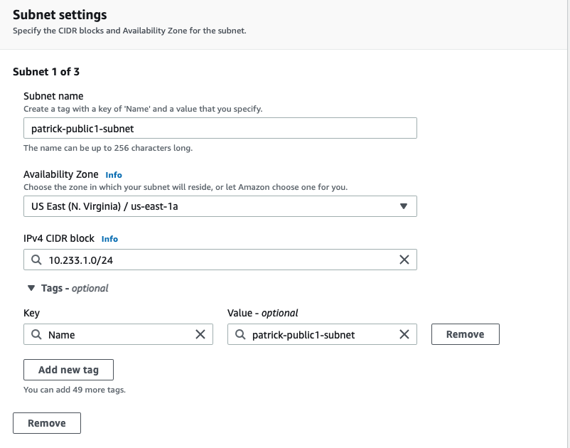
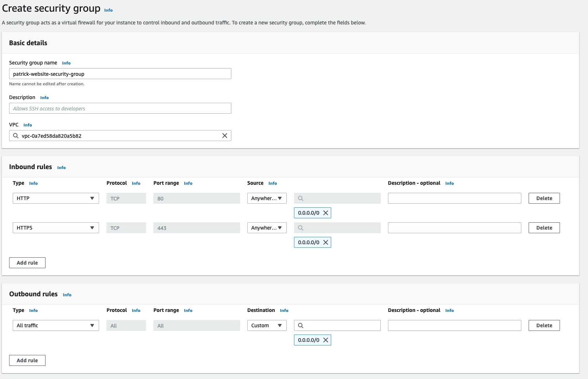
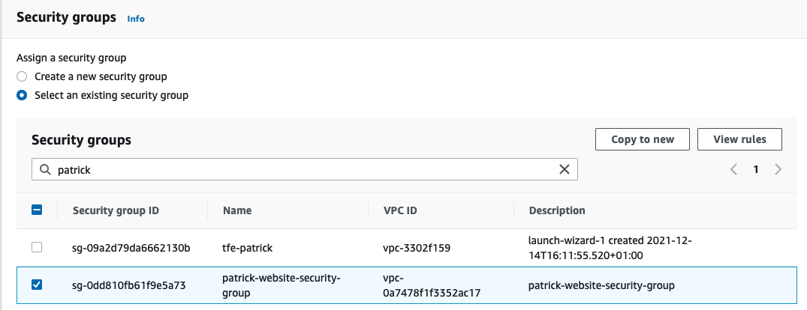
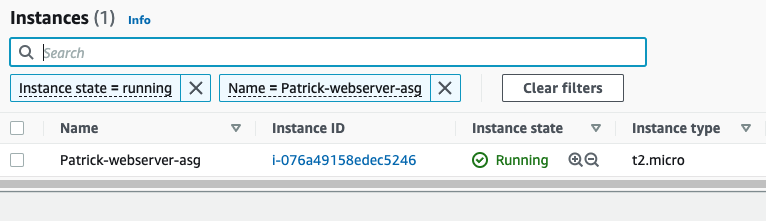

# Manual steps

## Summary
This document describes the manual steps for creating a autoscaling group with webservers behind an application load balancer which you can then connect to over the internet. The webserver is in a private subnet

See below diagram for how the setup is:  


## Steps to take
- Create a VPC with cidr block ```10.233.0.0/16```  
  
- Create 3 subnets. 2 public subnets and 1 private subnet
    - patrick-public1-subnet (ip: ```10.233.1.0/24``` availability zone: ```us-east-1a```)  
    - patrick-public2-subnet (ip: ```10.233.2.0/24``` availability zone: ```us-east-1b```)  
    - patrick-private1-subnet (ip: ```10.233.11.0/24``` availability zone: ```us-east-1a```)  
  
  
  
  
- create an internet gateway  
    
  
- create a nat gateway which you attach to ```patrick-public1-subnet```   
  
- create routing table for public  
  
   - edit the routing table for internet access to the internet gateway
     
- create routing table for private  
     
   - edit the routing table for internet access to the nat gateway  
      
- attach routing tables to subnets  
    - patrick-public-route to public subnets      
          
    - patrick-private-route to private subnet   
         
- create a security group that allows http and https from all locations    
    


- Auto Scaling - Launch Configurations  
  
- Create launch configuration. 
  
  
```
#cloud-config
runcmd:
  - apt-get install -y nginx
  - systemctl enable --no-block nginx 
  - systemctl start --no-block nginx 
````
  
  
  
- The launch configuration should now be visible  
  

- loadbalancer create a target group which we at a later point connect to the Auto Scaling Group
  
  
- Will have no targets yet
   

- loadbalancer create a appplication load balancer which will connect to the load balancer target  
  
  
  
  
  
  

- Auto Scaling groups. Will configure the group and connect it to auto scaling launch and the created load balancer  
  
  
  
  
  
  
  

- loadbalancer generated a DNS name which you can use to connect to the application server  
  
[patrick-loadbalancer-1479571194.us-east-1.elb.amazonaws.com](patrick-loadbalancer-1479571194.us-east-1.elb.amazonaws.com)

### Test the autoscaling

After everything is working you should see one web server running and one web server as a target in the load balancer target group

EC2   
  

Load balancer target  


**Change the Auto scaling group to have 2 servers**
- Edit your Auto scaling group  
  
- Change the desired capacity to 2  
  
- After that you should see 2 EC2 instances and load balancer target with 2 instances  
  
  
